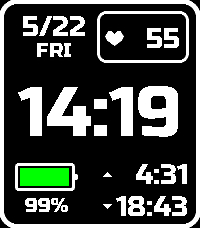

# Typical Outdoor

A clean, information-dense watchface for the Pebble Emery (200×228).



## Features

- **Large time display** — Russo One font, 24h or 12h based on system setting
- **Date & day** — top-left (M/D and abbreviated weekday)
- **Heart rate** — live BPM from Pebble Health, shown in a rounded box
- **Battery** — color-coded bar (green / yellow / red) with percentage
- **Sunrise & sunset** — calculated from your GPS location via NOAA algorithm, refreshed at midnight

## Platform

| Field        | Value            |
| ------------ | ---------------- |
| Target       | Pebble Emery     |
| SDK          | 3                |
| Capabilities | health, location |
| Font         | Russo One        |

## Build

> **Note:** `resources/RussoOne.ttf` is not included in this repository.
> Download [Russo One](https://fonts.google.com/specimen/Russo+One) from Google Fonts and place the `.ttf` file in `resources/` before building.

```sh
pebble build
pebble install --phone <IP>
```

## Links

- [Pebble Appstore](https://apps.repebble.com/typical-outdoor_246967574a054baa90f691bf)
- Developer: **rukari** / [@hidea](https://bsky.app/profile/hidea.bsky.social) on Bluesky

## How sunrise/sunset works

The PebbleKit JS side (`src/pkjs/index.js`) fetches the device's GPS coordinates on startup and at midnight, then computes sunrise and sunset times using the NOAA simplified solar position algorithm. The results (minutes since midnight, local time) are sent to the watch via `AppMessage` and persisted across reboots.
